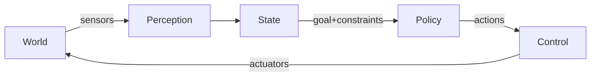

# Chapter 1 - Physical AI / Embodied Intelligence

## Learning Objectives

- Explain the closed-loop “agent loop” and why feedback is required for control.
- Implement a simple ROS 2 controller that uses state feedback to reach a goal.
- Identify how latency, blocking callbacks, and safety constraints affect robot behavior.

## Key Terms

- Physical AI, embodied intelligence, closed-loop control, feedback, latency budget, safety constraint

## Prerequisites

- Completed `Setup` and can run `ros2` commands.
- Installed turtlesim:

```bash
sudo apt update
sudo apt install -y ros-humble-turtlesim
```

## Concepts

### The “agent loop” (why robots are different)

In robotics, your model is part of a closed loop:



Key implications:

- **Latency matters**: a correct decision that arrives late is wrong.
- **Feedback matters**: you can’t “batch evaluate”; you must observe → act → observe.
- **Safety matters**: you need constraints and predictable failure modes.

### What counts as “Physical AI” in this course

- Reactive controllers (good baseline).
- Classical planning + control (still required).
- Learned components (perception, behavior priors).
- “VLA” stacks: speech/LLM planning feeding structured robot actions.

## Hands-on Lab: closed-loop control with `turtlesim` (ROS 2 Python)

Goal: write a tiny ROS 2 "agent" that drives the turtle to a goal position using feedback.

## Lab Deliverable

- A runnable node `q2_agent/goal_seek.py` that reaches a commanded goal (within a tolerance) using `/turtle1/pose` feedback and publishes `/turtle1/cmd_vel`.

## Assessment Item

- Demonstration check: run the node to reach two different goals and explain (briefly) what state is observed and what action is published.

### 1) Start turtlesim

```bash
# Terminal A
source /opt/ros/humble/setup.bash
ros2 run turtlesim turtlesim_node
```

```bash
# Terminal B
source /opt/ros/humble/setup.bash
ros2 run turtlesim turtle_teleop_key
```

Confirm topics:

```bash
ros2 topic list | rg turtlesim
ros2 topic echo /turtle1/pose --once
```

### 2) Create a workspace package

```bash
mkdir -p ~/q2_ws/src
cd ~/q2_ws/src
ros2 pkg create q2_agent --build-type ament_python --dependencies rclpy geometry_msgs turtlesim
```

### 3) Add a goal-seeking controller node

Create `~/q2_ws/src/q2_agent/q2_agent/goal_seek.py`:

```python
import math

import rclpy
from rclpy.node import Node
from geometry_msgs.msg import Twist
from turtlesim.msg import Pose


class GoalSeek(Node):
    def __init__(self) -> None:
        super().__init__("goal_seek")
        self.goal_x = float(self.declare_parameter("goal_x", 8.0).value)
        self.goal_y = float(self.declare_parameter("goal_y", 8.0).value)

        self.pose: Pose | None = None
        self.sub = self.create_subscription(Pose, "/turtle1/pose", self.on_pose, 10)
        self.pub = self.create_publisher(Twist, "/turtle1/cmd_vel", 10)
        self.timer = self.create_timer(0.05, self.on_tick)  # 20 Hz

    def on_pose(self, msg: Pose) -> None:
        self.pose = msg

    def on_tick(self) -> None:
        if self.pose is None:
            return

        dx = self.goal_x - self.pose.x
        dy = self.goal_y - self.pose.y
        distance = math.hypot(dx, dy)
        goal_theta = math.atan2(dy, dx)
        heading_error = self._wrap(goal_theta - self.pose.theta)

        cmd = Twist()
        cmd.angular.z = 4.0 * heading_error
        cmd.linear.x = 1.5 * distance if abs(heading_error) < 0.7 else 0.0
        self.pub.publish(cmd)

        if distance < 0.15:
            self.get_logger().info("Goal reached")
            self.pub.publish(Twist())
            rclpy.shutdown()

    @staticmethod
    def _wrap(angle: float) -> float:
        while angle > math.pi:
            angle -= 2 * math.pi
        while angle < -math.pi:
            angle += 2 * math.pi
        return angle


def main() -> None:
    rclpy.init()
    node = GoalSeek()
    rclpy.spin(node)


if __name__ == "__main__":
    main()
```

Register the entry point in `~/q2_ws/src/q2_agent/setup.py` (add to `console_scripts`):

```python
entry_points={
    "console_scripts": [
        "goal_seek = q2_agent.goal_seek:main",
    ],
},
```

Build:

```bash
cd ~/q2_ws
colcon build --symlink-install
source ~/q2_ws/install/setup.bash
```

Run:

```bash
ros2 run q2_agent goal_seek --ros-args -p goal_x:=2.0 -p goal_y:=9.0
```

## Troubleshooting

- Node exits immediately
  - You never received `/turtle1/pose`. Ensure `turtlesim_node` is running.
- Turtle spins wildly
  - Heading gain too high. Lower `cmd.angular.z` multiplier (e.g., `2.0 * heading_error`).
- Turtle overshoots the goal
  - Add a max speed clamp, or reduce linear gain.

## Quick Quiz

1. Why is latency often more important than accuracy in robot control loops?
2. In the lab, what variable is the “state estimate”?
3. What happens if you publish control commands without subscribing to feedback?
