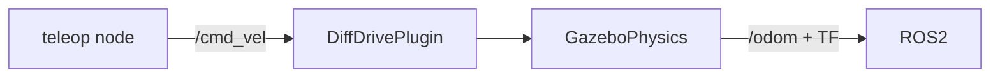

# Chapter 5 - Gazebo Simulation (Classic) + Diff Drive

## Learning Objectives

- Explain how Gazebo plugins bridge ROS commands into simulation physics.
- Spawn a robot and drive it via `/cmd_vel` while validating `/odom` and sim time.
- Diagnose common sim failures (wrong units, inverted wheels, broken TF).

## Key Terms

- Gazebo Classic, plugin, diff drive, `/cmd_vel`, `/odom`, `use_sim_time`, physics engine

## Prerequisites

- Gazebo Classic integration installed:

```bash
sudo apt update
sudo apt install -y ros-humble-gazebo-ros-pkgs
```

- Completed Chapter 4 (`q2_minibot_description` exists).

## Concepts

### Why simulate early

Simulation catches:

- bad TF trees (frames jumping)
- wrong units (meters vs centimeters)
- control sign errors (left/right inverted)
- missing constraints (robot “teleports” because physics is wrong)

### URDF + Gazebo plugins (what’s really happening)

Gazebo needs:

- a model (your URDF)
- physics properties (friction, inertial sanity)
- a control interface (plugin)

For a simple diff-drive:



## Hands-on Lab: spawn minibot in Gazebo and drive it with `/cmd_vel`

### 1) Add a Gazebo-ready Xacro

Create a sim-specific robot description by copying your Chapter 4 file and adding Gazebo tags:

```bash
cp ~/q2_ws/src/q2_minibot_description/urdf/minibot.urdf.xacro \
  ~/q2_ws/src/q2_minibot_description/urdf/minibot.gazebo.urdf.xacro
```

Edit `~/q2_ws/src/q2_minibot_description/urdf/minibot.gazebo.urdf.xacro` and append the following
just before the closing `</robot>`:

```xml
  <!-- Simple ground contact tuning -->
  <gazebo reference="base_link">
    <mu1>0.8</mu1>
    <mu2>0.8</mu2>
  </gazebo>

  <!-- Differential drive plugin -->
  <gazebo>
    <plugin name="diff_drive" filename="libgazebo_ros_diff_drive.so">
      <ros>
        <namespace>/</namespace>
      </ros>
      <left_joint>left_wheel_joint</left_joint>
      <right_joint>right_wheel_joint</right_joint>
      <wheel_separation>0.30</wheel_separation>
      <wheel_diameter>0.10</wheel_diameter>
      <command_topic>cmd_vel</command_topic>
      <odometry_topic>odom</odometry_topic>
      <odometry_frame>odom</odometry_frame>
      <robot_base_frame>base_link</robot_base_frame>
      <publish_odom>true</publish_odom>
      <publish_wheel_tf>true</publish_wheel_tf>
      <update_rate>50</update_rate>
    </plugin>
  </gazebo>
```

### 2) Add a spawn launch file

Create `~/q2_ws/src/q2_minibot_description/launch/spawn_minibot_gazebo.launch.py`:

```python
from launch import LaunchDescription
from launch.actions import IncludeLaunchDescription
from launch.launch_description_sources import PythonLaunchDescriptionSource
from launch_ros.actions import Node
from launch.substitutions import Command, PathJoinSubstitution
from launch_ros.substitutions import FindPackageShare


def generate_launch_description():
    pkg_share = FindPackageShare("q2_minibot_description")
    xacro_file = PathJoinSubstitution([pkg_share, "urdf", "minibot.gazebo.urdf.xacro"])
    robot_description = {"robot_description": Command(["xacro ", xacro_file])}

    gazebo_launch = IncludeLaunchDescription(
        PythonLaunchDescriptionSource(
            [FindPackageShare("gazebo_ros"), "/launch/gazebo.launch.py"]
        )
    )

    return LaunchDescription(
        [
            gazebo_launch,
            Node(
                package="robot_state_publisher",
                executable="robot_state_publisher",
                parameters=[robot_description, {"use_sim_time": True}],
            ),
            Node(
                package="gazebo_ros",
                executable="spawn_entity.py",
                arguments=["-topic", "robot_description", "-entity", "minibot"],
                output="screen",
            ),
        ]
    )
```

### 3) Install the new files

Edit `~/q2_ws/src/q2_minibot_description/CMakeLists.txt` to ensure `urdf/` and `launch/` are
installed (from Chapter 4).

### 4) Build and run

```bash
cd ~/q2_ws
colcon build --symlink-install
source ~/q2_ws/install/setup.bash
ros2 launch q2_minibot_description spawn_minibot_gazebo.launch.py
```

Drive it:

```bash
sudo apt install -y ros-humble-teleop-twist-keyboard
ros2 run teleop_twist_keyboard teleop_twist_keyboard
```

Inspect odometry:

```bash
ros2 topic echo /odom --once
ros2 topic list | rg cmd_vel

## Lab Deliverable

- A Gazebo bringup where the robot spawns and responds to `/cmd_vel` and publishes `/odom` without TF/time inconsistencies.

## Assessment Item

- Practical check: demonstrate motion and provide one diagnosis transcript (the commands you ran) for a simulated failure and fix.
```

## Troubleshooting

- Gazebo opens but robot doesn’t spawn
  - Check spawn output (the `spawn_entity.py` node prints errors).
  - Verify `robot_description` exists:
    `ros2 param get /robot_state_publisher robot_description | head`
- Robot spawns but doesn’t move
  - Confirm `/cmd_vel` is published:
    `ros2 topic echo /cmd_vel --once`
  - Confirm plugin is loaded (Gazebo console shows plugin errors).
- Robot moves but odom/TF looks wrong
  - Your wheel separation/diameter are wrong. Fix `<wheel_separation>` and `<wheel_diameter>`.

## Quick Quiz

1. What does the diff drive plugin consume, and what does it publish?
2. Why do we set `use_sim_time:=True` in simulation nodes?
3. Name one common reason a robot “moves backwards” in sim.
