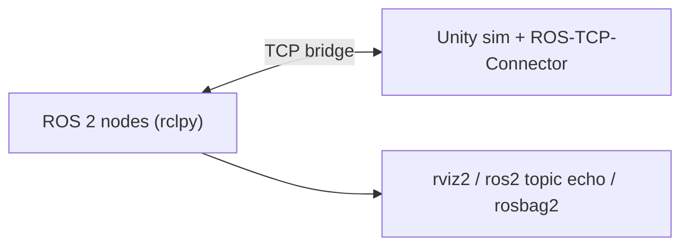

# Chapter 6 - Unity Simulation (ROS-TCP-Connector Pattern)

## Learning Objectives

- Explain when Unity is beneficial vs Gazebo (visuals, UX, assets, domain randomization).
- Describe the ROS ↔ Unity bridge pattern and why ROS remains the system-of-record.
- Define a minimal, stable message contract suitable for external simulation/visualization.

## Key Terms

- ROS-TCP-Connector, bridge, message contract, system-of-record, namespace, latency

## Prerequisites

- ROS 2 Humble working locally.
- Unity installed (assumption): Unity 2022 LTS.

## Concepts

### When Unity is worth it

Use Unity when you need:

- fast iteration on visuals/UX
- custom environments and assets
- domain randomization tooling

But: Unity is not “ROS-native”. You typically bridge via TCP and keep ROS as the system-of-record.

### Minimal architecture (ROS ↔ Unity)



Rules of thumb:

- Unity owns rendering + “game loop”.
- ROS owns message schemas + transforms + navigation/behavior logic.
- Keep message types standard (`geometry_msgs/Twist`, `sensor_msgs/Image`) unless you must customize.

## Hands-on Lab: ROS-side control interface you can later connect from Unity

This lab is runnable without Unity. Unity becomes the publisher/subscriber later.

### 1) Create a ROS interface package

```bash
cd ~/q2_ws/src
ros2 pkg create q2_unity_bridge --build-type ament_python --dependencies rclpy geometry_msgs std_msgs
```

### 2) Add a “command mirror” node

Create `~/q2_ws/src/q2_unity_bridge/q2_unity_bridge/cmd_mirror.py`:

```python
import rclpy
from rclpy.node import Node
from geometry_msgs.msg import Twist
from std_msgs.msg import String


class CmdMirror(Node):
    def __init__(self) -> None:
        super().__init__("cmd_mirror")
        self.sub = self.create_subscription(Twist, "/cmd_vel", self.on_cmd, 10)
        self.pub = self.create_publisher(String, "/unity/last_cmd", 10)

    def on_cmd(self, msg: Twist) -> None:
        out = String()
        out.data = f"lin={msg.linear.x:.2f} ang={msg.angular.z:.2f}"
        self.pub.publish(out)


def main() -> None:
    rclpy.init()
    rclpy.spin(CmdMirror())


if __name__ == "__main__":
    main()
```

Register in `~/q2_ws/src/q2_unity_bridge/setup.py`:

```python
entry_points={
    "console_scripts": [
        "cmd_mirror = q2_unity_bridge.cmd_mirror:main",
    ],
},
```

Build + run:

```bash
cd ~/q2_ws
colcon build --symlink-install
source ~/q2_ws/install/setup.bash
ros2 run q2_unity_bridge cmd_mirror
```

Publish a command (acts like “Unity would publish `/cmd_vel`”):

```bash
ros2 topic pub --once /cmd_vel geometry_msgs/msg/Twist "{linear: {x: 0.5}, angular: {z: 0.8}}"
ros2 topic echo /unity/last_cmd --once
```

### 3) Unity-side (outline, explicit assumptions)

Assumption: you use Unity’s **ROS-TCP-Connector** package and a TCP endpoint on the ROS machine.

Minimum steps (Unity UI names change across versions):

- Add ROS-TCP-Connector package (via Unity Package Manager).
- Configure the ROS TCP endpoint (host/IP + port).
- Subscribe/publish these topics:
  - Publish `geometry_msgs/Twist` on `/cmd_vel`
  - Subscribe to `std_msgs/String` on `/unity/last_cmd` (sanity/debug)

## Lab Deliverable

- A runnable ROS node that mirrors `/cmd_vel` into a debug topic (`/unity/last_cmd`) to validate message contracts without requiring Unity installed.

## Assessment Item

- Quiz: list two reasons to keep ROS as the system-of-record even when Unity renders the environment.

## Troubleshooting

- Unity connects but messages don't appear in ROS
  - Confirm message definitions match exactly (fields + names).
  - Confirm the topic name and namespace.
- ROS receives messages but robot doesn't move
  - Your sim controller isn’t consuming `/cmd_vel` yet; validate the rest of the pipeline first.
- Everything works but delays are huge
  - You are sending too much data (e.g., uncompressed images). Start with low-rate small messages.

## Quick Quiz

1. Why is it useful to keep ROS as the “system-of-record” even with Unity in the loop?
2. What’s the first message type you should use for mobile base control?
3. What is the most common cause of “connected but nothing works” in a ROS↔Unity bridge?
