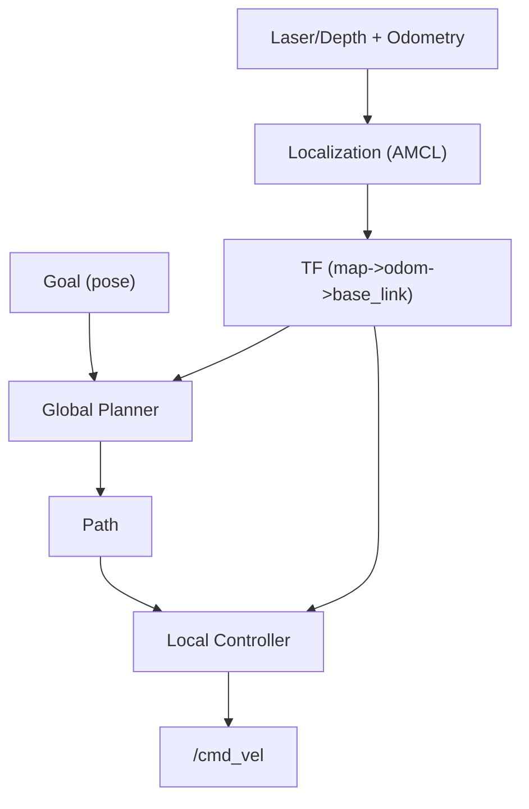

# Chapter 8 - Nav2 (Mapping, Localization, Navigation)

## Learning Objectives

- Describe Nav2’s high-level architecture (planner/controller/localization) and how actions drive navigation.
- Explain the minimum transform chain required for navigation (`map -> odom -> base_link`).
- Execute a simple navigate-to-goal flow in simulation and identify common failure modes.

## Key Terms

- Nav2, AMCL, costmap, behavior tree, `NavigateToPose`, `map/odom/base_link`

## Prerequisites

- ROS 2 Humble installed.
- For the lab, install TurtleBot3 + Nav2 packages:

```bash
sudo apt update
sudo apt install -y ros-humble-nav2-bringup ros-humble-turtlebot3*
```

## Concepts

### The Nav2 stack (big picture)



Nav2 is action-driven. The core “do the thing” API is:

- `nav2_msgs/action/NavigateToPose`

### Why Nav2 is hard in practice

The failure modes are usually not “Nav2 is broken”. They’re:

- wrong TF frames
- bad odometry scaling
- sensor noise or wrong frame IDs
- costmap inflation/clearing misconfiguration

## Hands-on Lab: navigate in TurtleBot3 Gazebo

### 1) Set TurtleBot3 model

```bash
echo "export TURTLEBOT3_MODEL=burger" >> ~/.bashrc
source ~/.bashrc
```

### 2) Launch Gazebo world

```bash
# Terminal A
source /opt/ros/humble/setup.bash
ros2 launch turtlebot3_gazebo turtlebot3_world.launch.py
```

### 3) Launch Nav2 (sim time)

```bash
# Terminal B
source /opt/ros/humble/setup.bash
ros2 launch turtlebot3_navigation2 navigation2.launch.py use_sim_time:=True
```

### 4) Send a navigation goal

In RViz (opens via the Nav2 launch):

- Click “2D Pose Estimate” (set initial pose)
- Click “Nav2 Goal” (send a goal)

CLI alternative (advanced): send a goal to `NavigateToPose` via `ros2 action send_goal`.

## Lab Deliverable

- A successful “navigate to pose” run in simulation (RViz goal) and a short troubleshooting note for one failure you encountered or simulated.

## Assessment Item

- Quiz: when should navigation be an action instead of a service? Provide one reason tied to feedback/result semantics.

## Troubleshooting

- RViz shows “No transform from [map] to [base_link]”
  - Your TF tree is broken. Check: `ros2 run tf2_ros tf2_echo map base_link`.
- Robot doesn’t move, costmap shows obstacles everywhere
  - Laser frame mismatch or stale sensor data. Check timestamps and `use_sim_time`.
- Robot oscillates or spins near goal
  - Controller tuning issue; reduce max velocities and/or adjust goal tolerances.

## Quick Quiz

1. What are the three core frames Nav2 relies on for a mobile robot?
2. Why does a wrong wheel diameter break navigation even if TF “looks fine”?
3. What tool do you use to confirm transforms exist at runtime?
