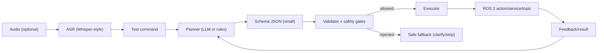

# Chapter 9 — VLA: Whisper + LLM Planning → ROS 2 Actions

## Learning Objectives

- Describe a safe voice/text-to-action pipeline: command → plan → validated actions.
- Implement a schema-constrained interface that prevents free-form LLM text from reaching actuators.
- Connect validated plans to ROS 2 actions (Nav2) and observe failures safely.

## Key Terms

- ASR, intent, schema validation, tool use, action server, safety constraints

## Prerequisites

- ROS 2 Humble.
- Nav2 lab working (Chapter 8) if you want real navigation goals.
- Python venv basics (we’ll optionally install speech/LLM libs).

## Concepts

### What “VLA” means in robotics

We’ll use “VLA” as a practical pipeline:

1. **Speech → text** (Whisper-style ASR)
2. **Text → plan** (LLM or rule-based planner)
3. **Plan → structured robot actions** (ROS 2 actions/services/topics)

Key rule: LLM output must be **validated** before it touches actuators.



### Safe interface: constrain outputs to a schema

Instead of “free-form text”, define a small command schema:

```text
NAVIGATE(goal_id: string)
SAY(text: string)
STOP()
```

Then implement:

- parser + validator
- executor (Nav2 action client)

## Hands-on Lab (runnable): text command → validated plan → Nav2 goal

This lab runs without Whisper/LLM. We use typed commands to prove the integration.

### 1) Create package

```bash
cd ~/q2_ws/src
ros2 pkg create q2_vla --build-type ament_python --dependencies rclpy std_msgs geometry_msgs nav2_msgs
```

### 2) Command input node (stdin → `/vla/command`)

Create `~/q2_ws/src/q2_vla/q2_vla/command_input.py`:

```python
import threading

import rclpy
from rclpy.node import Node
from std_msgs.msg import String


class CommandInput(Node):
    def __init__(self) -> None:
        super().__init__("command_input")
        self.pub = self.create_publisher(String, "/vla/command", 10)
        self._thread = threading.Thread(target=self._loop, daemon=True)
        self._thread.start()
        self.get_logger().info("Type commands like: go kitchen | go lab | stop")

    def _loop(self) -> None:
        while rclpy.ok():
            try:
                line = input("> ").strip()
            except EOFError:
                break
            if not line:
                continue
            msg = String()
            msg.data = line
            self.pub.publish(msg)


def main() -> None:
    rclpy.init()
    rclpy.spin(CommandInput())


if __name__ == "__main__":
    main()
```

### 3) Planner node (validated plan → `/vla/plan`)

Create `~/q2_ws/src/q2_vla/q2_vla/planner.py`:

```python
import json

import rclpy
from rclpy.node import Node
from std_msgs.msg import String


class Planner(Node):
    def __init__(self) -> None:
        super().__init__("planner")
        self.goals = {
            "kitchen": {"x": 1.0, "y": 0.0, "yaw": 0.0},
            "lab": {"x": 0.0, "y": 1.0, "yaw": 1.57},
        }
        self.sub = self.create_subscription(String, "/vla/command", self.on_cmd, 10)
        self.pub = self.create_publisher(String, "/vla/plan", 10)

    def on_cmd(self, msg: String) -> None:
        text = msg.data.lower().strip()
        if text.startswith("go "):
            goal_id = text.replace("go ", "", 1).strip()
            if goal_id not in self.goals:
                self._publish({"type": "SAY", "text": f"Unknown goal '{goal_id}'"})
                return
            self._publish({"type": "NAVIGATE", "goal_id": goal_id, "pose": self.goals[goal_id]})
            return

        if text == "stop":
            self._publish({"type": "STOP"})
            return

        self._publish({"type": "SAY", "text": "Try: go kitchen | go lab | stop"})

    def _publish(self, plan: dict) -> None:
        out = String()
        out.data = json.dumps(plan)
        self.pub.publish(out)


def main() -> None:
    rclpy.init()
    rclpy.spin(Planner())


if __name__ == "__main__":
    main()
```

### 4) Nav2 executor (plan → `NavigateToPose`)

Create `~/q2_ws/src/q2_vla/q2_vla/nav2_executor.py`:

```python
import json
import math

import rclpy
from rclpy.node import Node
from rclpy.action import ActionClient
from std_msgs.msg import String
from geometry_msgs.msg import PoseStamped
from nav2_msgs.action import NavigateToPose


def yaw_to_quat(yaw: float) -> tuple[float, float, float, float]:
    half = yaw / 2.0
    return (0.0, 0.0, math.sin(half), math.cos(half))


class Nav2Executor(Node):
    def __init__(self) -> None:
        super().__init__("nav2_executor")
        self.client = ActionClient(self, NavigateToPose, "navigate_to_pose")
        self.sub = self.create_subscription(String, "/vla/plan", self.on_plan, 10)

    def on_plan(self, msg: String) -> None:
        try:
            plan = json.loads(msg.data)
        except json.JSONDecodeError:
            self.get_logger().error("Invalid JSON plan")
            return

        if plan.get("type") == "STOP":
            self.get_logger().warn("STOP requested (no cancel implemented in this minimal lab)")
            return

        if plan.get("type") != "NAVIGATE":
            self.get_logger().info(f"Non-nav plan: {plan}")
            return

        pose = plan.get("pose") or {}
        goal = PoseStamped()
        goal.header.frame_id = "map"
        goal.header.stamp = self.get_clock().now().to_msg()
        goal.pose.position.x = float(pose.get("x", 0.0))
        goal.pose.position.y = float(pose.get("y", 0.0))
        qx, qy, qz, qw = yaw_to_quat(float(pose.get("yaw", 0.0)))
        goal.pose.orientation.x = qx
        goal.pose.orientation.y = qy
        goal.pose.orientation.z = qz
        goal.pose.orientation.w = qw

        self._send_goal(goal)

    def _send_goal(self, goal_pose: PoseStamped) -> None:
        if not self.client.wait_for_server(timeout_sec=2.0):
            self.get_logger().error("Nav2 action server not available. Start Nav2 first.")
            return
        goal_msg = NavigateToPose.Goal()
        goal_msg.pose = goal_pose
        self.get_logger().info("Sending Nav2 goal...")
        self.client.send_goal_async(goal_msg)


def main() -> None:
    rclpy.init()
    rclpy.spin(Nav2Executor())


if __name__ == "__main__":
    main()
```

### 5) Register + build + run (with Nav2 running)

Edit `~/q2_ws/src/q2_vla/setup.py`:

```python
entry_points={
    "console_scripts": [
        "command_input = q2_vla.command_input:main",
        "planner = q2_vla.planner:main",
        "nav2_executor = q2_vla.nav2_executor:main",
    ],
},
```

Build:

```bash
cd ~/q2_ws
colcon build --symlink-install
source ~/q2_ws/install/setup.bash
```

Run nodes:

```bash
# Terminal C (after Chapter 8 terminals are running Nav2)
ros2 run q2_vla planner
```

```bash
# Terminal D
ros2 run q2_vla nav2_executor
```

```bash
# Terminal E
ros2 run q2_vla command_input
```

Type:

```text
go kitchen
```

## Lab Deliverable

- A runnable `q2_vla` package that publishes `/vla/command` and `/vla/plan`, and an executor that triggers a navigation action only from validated schema JSON.

## Assessment Item

- Practical prompt: provide one ambiguous voice/text command and show the “safe fallback” behavior your system uses.

## Hands-on Lab (optional): add Whisper + an LLM planner

Assumptions (pick one; both are optional):

- Speech: `faster-whisper` (GPU optional)
- LLM: local model via Ollama, or a hosted API (requires keys + network)

Guideline: keep this structure:

```text
audio -> ASR -> text -> (LLM -> schema) -> validator -> executor
```

Minimum safety rule:

- The executor MUST only consume validated schema JSON (never raw LLM text).

## Troubleshooting

- `nav2_executor` logs “action server not available”
  - Nav2 isn’t running, or the action name differs. Check: `ros2 action list | rg navigate`.
- Robot tries to navigate to a nonsense location
  - Your `goal_id` → pose mapping is wrong. Make it explicit and version-controlled.
- “STOP requested” doesn’t stop navigation
  - You need action cancellation (`GoalHandle.cancel_goal_async()`); implement it as an exercise.

## Quick Quiz

1. Why do we force the planner output into a schema before execution?
2. Where is the best place to implement safety constraints: ASR, LLM, or executor? Why?
3. What ROS primitive is best for navigation goals: topic, service, or action?
