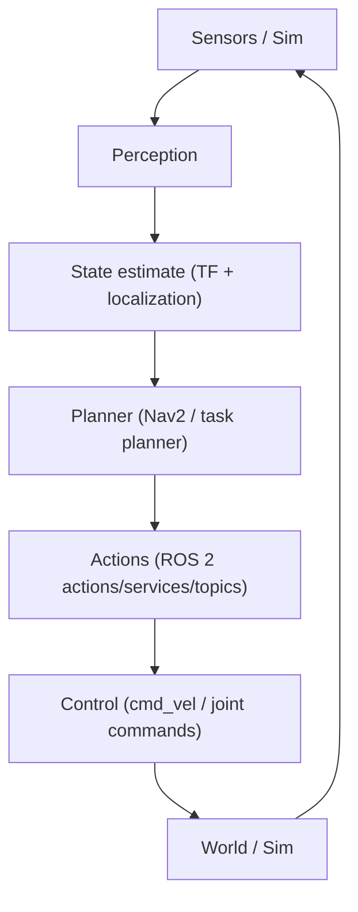

# Chapter 10 — Capstone Project

## Learning Objectives

- Integrate sensing, state estimation, planning, and control into a coherent ROS graph.
- Define a reproducible bringup and an evaluation rubric (reliability, observability, safety).
- Demonstrate end-to-end autonomy in simulation with traceable decisions.

## Key Terms

- bringup, launch, autonomy, telemetry, evaluation, safety boundary, regression

## Prerequisites

- You can run a robot in simulation (Gazebo or TurtleBot3 + Nav2).
- You can build and run `rclpy` packages in `~/q2_ws`.
- You have a working TF tree and can debug it.

## Concepts


### The capstone goal (what you're actually building)

Build a **humanoid-ish or mobile manipulation** simulation demo with:

- a robot model (URDF/Xacro)
- a simulated world (Gazebo or Unity)
- navigation or locomotion control (Nav2 for mobile base, or a simplified gait/controller)
- a “VLA-style” interface:
  - speech or text → plan → validated robot actions

### Definition of done (testable)

You must be able to:

1. Launch the sim in one command (launch file).
2. Visualize TF + robot state in RViz.
3. Execute at least 3 high-level commands reliably (e.g., “go to X”, “stop”, “return home”).
4. Demonstrate a failure mode + recovery (e.g., blocked path → replan).



## Hands-on Lab: capstone scaffold (repo/workspace layout)

Use a clean workspace layout:

```text
~/q2_ws/src/
  q2_<project>_description/   # URDF/Xacro + meshes
  q2_<project>_sim/           # Gazebo/Unity glue + worlds + launch
  q2_<project>_bringup/       # launch + parameters
  q2_<project>_vla/           # command interface + planner + executor
```

Deliver a single “bringup” entry point:

```bash
ros2 launch q2_<project>_bringup bringup.launch.py
```

## Lab Deliverable

- A one-command bringup launch file plus a recorded demonstration (or log transcript) showing the system accepting at least 3 commands and completing them reliably.

## Assessment Item

- Capstone rubric: pass/fail gates for reproducibility, observability, reliability, and safety (documented in your final submission).

## Troubleshooting

- Your demo “works” but is unreproducible
  - You hard-coded paths, relied on manual steps, or didn’t version configs. Fix with launch files
    + parameters.
- You can’t debug failures
  - You didn’t log state transitions or expose topics. Add structured logs + topic mirrors.
- Sim and RViz disagree about the robot pose
  - `use_sim_time` mismatch or TF published twice. Make a single source of truth for TF.

## Quick Quiz

1. What’s your capstone’s “safety boundary” (what it will never do)?
2. Which part of your system is most likely to fail first in the real world, and why?
3. What measurement would convince you your system is improving (latency, success rate, etc.)?
