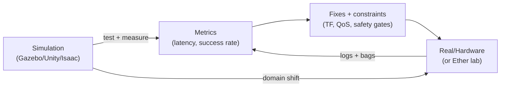

# Physical AI & Humanoid Robotics (Quarter 2)

Audience: intermediate developers who know basic Python/ML but are new to ROS 2 + simulation.

This course teaches you to:

- Build ROS 2 systems in Python (`rclpy`) with clean interfaces.
- Model robots with URDF/Xacro and reason about TF frames.
- Validate behavior in simulation (Gazebo and Unity patterns).
- Use Isaac Sim/Isaac ROS concepts for perception + acceleration.
- Navigate with Nav2 and integrate planning with modern "VLA" style stacks.

## Start Here

- Step 1: Complete setup: `/course-setup`
- Step 2: Build your first closed-loop agent: `/chapters/01-embodied-ai`
- Step 3: Run the Module 1 lab: `/labs/module-1-ros2-lab`


## A simple sim-to-real mental model



## Prerequisites

- Linux comfort: shell, files, permissions.
- Python: virtualenv, packages, basic OOP.
- ML basics: data, inference loops, latency/throughput tradeoffs.

## Concepts

### What “Physical AI” means here

Physical AI (embodied intelligence) is not “an LLM in a robot”. It’s a control and perception
system that must act under:

- Partial observability (no perfect state).
- Real-time constraints (deadlines, not just correctness).
- Safety constraints (don’t break hardware or people).
- Distribution shift (sim ≠ real).

### Why ROS 2 is the backbone

ROS 2 gives you:

- Standard message types + tools for introspection (`ros2 topic echo`, `rviz2`).
- A middleware abstraction (DDS) for distributed systems.
- A packaging/build system that scales from laptop → robot.

## Hands-on Lab: sanity check the tools

Assumption: you’re on **Ubuntu 22.04** and will install **ROS 2 Humble** in the next chapter.

After installation, validate:

```bash
source /opt/ros/humble/setup.bash
ros2 --help
ros2 topic --help
```

Run the classic talker/listener demo:

```bash
# Terminal A
source /opt/ros/humble/setup.bash
ros2 run demo_nodes_cpp talker
```

```bash
# Terminal B
source /opt/ros/humble/setup.bash
ros2 run demo_nodes_cpp listener
```

## Troubleshooting

- `ros2: command not found`
  - You didn’t source ROS: `source /opt/ros/humble/setup.bash`.
  - Or ROS isn’t installed yet (go to Setup).
- Talker runs, listener shows nothing
  - You are in different ROS domains. Check: `echo $ROS_DOMAIN_ID` in both terminals.
  - On multi-machine: you have DDS/network issues (we stay single-machine for now).

## Quick Quiz

1. Name two constraints that make physical AI harder than “web AI”.
2. What does ROS 2 standardize for you (at least 3 things)?
3. Why is “sim ≠ real” not just a physics problem?
